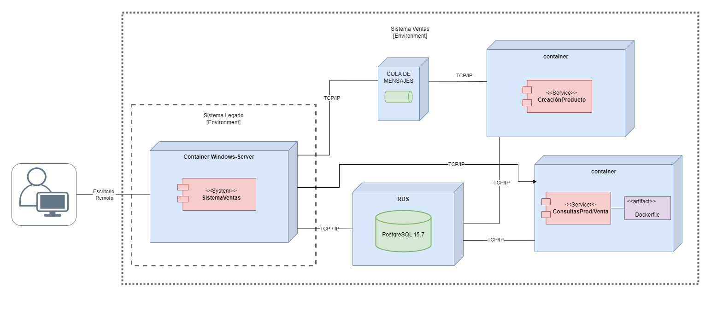
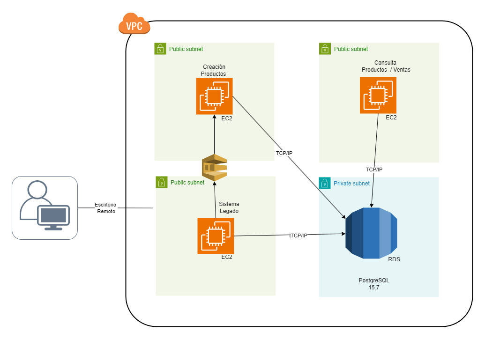

# Moderniación Infra

Infra del aplicativo (Sistema Ventas) en AWS usando TerraForm (IaC)

se ejecuta la modernización del software de acuerdo al diseño propuesto.

Sistema Legado: [Punto Venta](https://github.com/CristianAAV/MISW-4410-Modernizacion)

Video Explicativo: [Modernización](https://youtu.be/z8Lcejq1Nhg)

## Principales comnados

 - Iniciar el Proyecto 
   - terraform init

 - Validar Sintaxis de las declaraciones
   - terraform validate

 - Validar Estado antes de enviar
   - terraform plan

 - Confirmar cambios y enviar infra
   - terraform apply

 - Destruir los cambios y enviar infra
   - terraform destroy

 - Imprimir salida de variables
   - terraform output -json <variable>
  
## Con Variables

 - Validar Estado antes de enviar con un archivo
   - terraform plan -var-file /pat/to/file

 - Destruir los cambios y enviar infra y con doble confirmacion 
   - terraform destroy -var-file /pat/to/file -auto-approve

# **Dioagrama Despliegue**

# **Arquitectura de Infraestructura**

# **Base de datos Esquema**
Base de datos desplegada para el proyecto.

